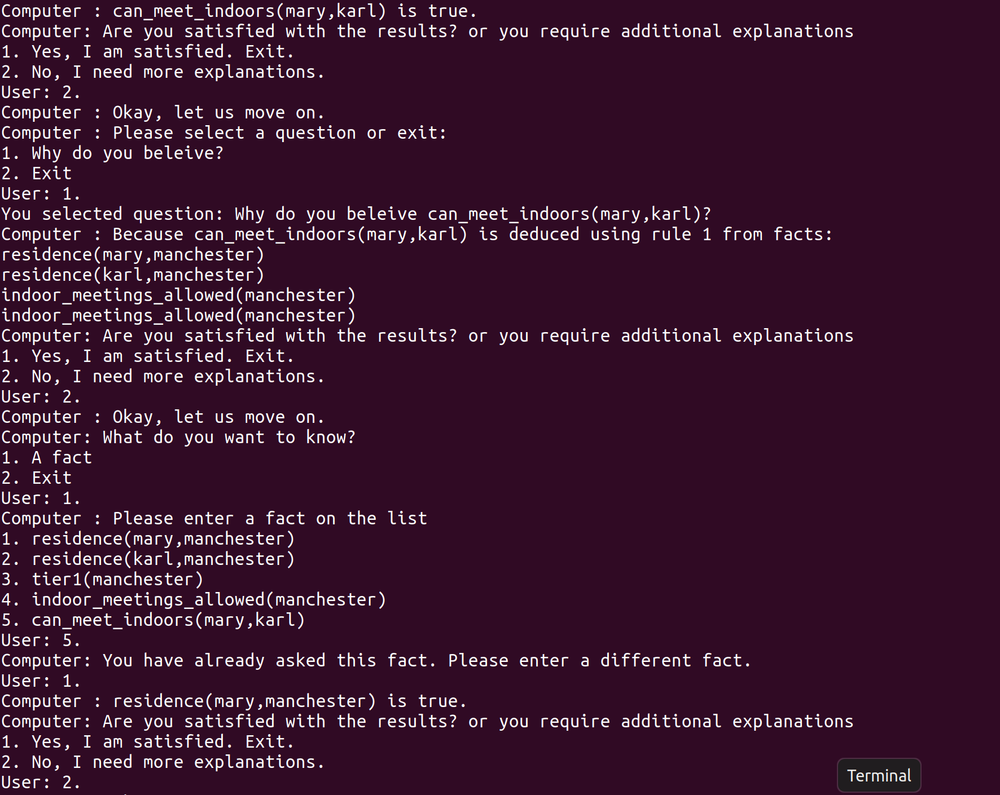

# Rule-based-system

1. File description: The main file is 'legal_move_v1.pl'. All example files are called 'louise1-4', before run the program, we should in the Rule-based-system directory and load the example file. \
`cd Rule-based-system`\
`swipl`\
`[louise]`\
`[legal_move_v1]`

2. In the example louise1.pl, here is the screenshot. In this example, the system only allow the user ask the same question once, and it lists all te facts, include the facts that has already been asked by the user. But if the user select the fact that they already been asked, the system will let the user choose another fact again until they choose a new fact to ask. 
 
